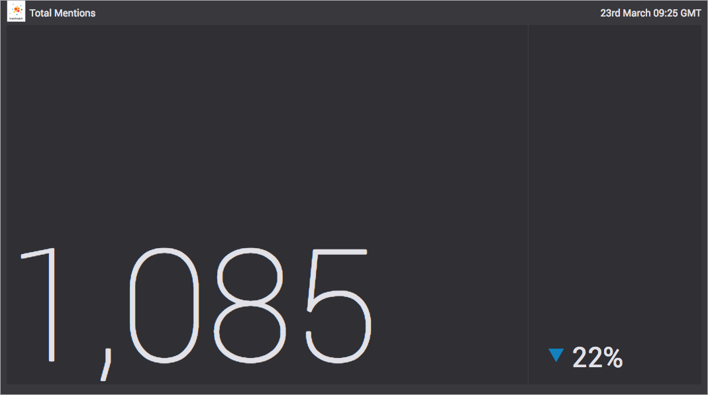

# destination-big-number



### `npm run-script`

Running the above command will output the following information about the scripts availiable:

```
Lifecycle scripts included in destination-big-number:
  test
    covert cli-test.js

available via `npm run-script`:
  lint
    eslint .
  ci
    npm run lint && npm run test
  demo
    wzrd demo.js
  browser-test
    wzrd test.js
```

#### `npm test`

This runs the CLI test via covert so will fail if code coverage is not 100%.

#### `npm run lint`

This runs eslint on the entire directory.

#### `npm run ci`

This runs both the above command and is intended for use on our CI environment.

#### `npm run demo`

This starts a server on localhost and serves the demo. default port is 9966.

#### `npm run browser-test`

This starts a server on localhost and runs the tests without code coverages. It uses default tape output so open the console to see results.

## Data Format

The destination can work in one of two ways:

### Number only

Simply emit an Int value to have this number displayed in the destination. The change indicator will not be displayed.

### Change indicator

Emit an object of format

```
{
    value: currentValue,
    change: percentageChange
}
```

This will display the number along with a change indicator showing how the number has changed.
