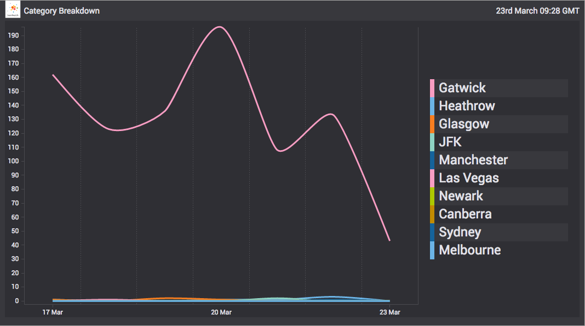
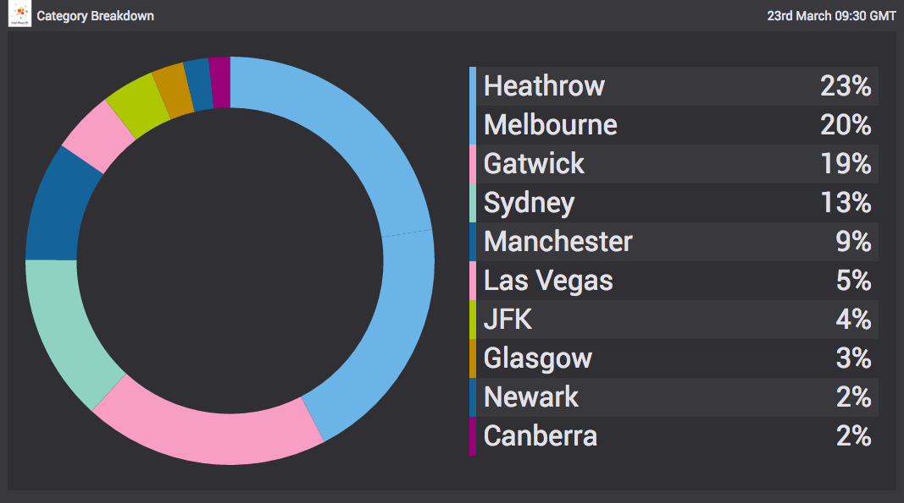
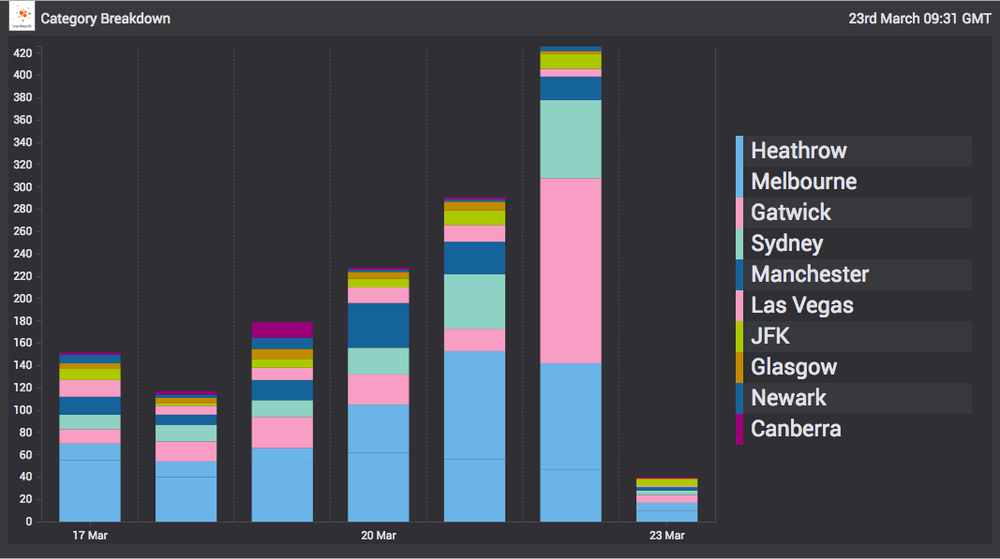

# destination-chart
A Vizia Tapir wrapped [C3 chart](http://c3js.org/) able to render and update itself using streaming data

### Options

ChartDestination is constructed with an options object with the following properties:

- `destTarget` - `String` - selector for the destination DOM node
- `onDataMethod` - `String | undefined` - defaults to `'flow'` - when set to `'flow'` data is fluidly appended to the chart over time and when set to `'load'` data is loaded into the chart in one go
- `flowLimit` - `Number | undefined` - defaults to `10` - the max number of points in the chart domain that will be displayed
- `showAverageLines` - `Boolean | undefined` - defaults to `false` - if set to true average lines will be displayed on the chart
- `chart` - `Object | undefined` - defaults to `{}` - can be used to set and override config passed into the [c3 generate call](http://c3js.org/gettingstarted.html#generate) which is used internally
- `interpolationType` - `String | undefined` - if set (e.g. to `'monotone'`) then c3's default interpolation type is overridden (more info [here](https://github.com/c3js/c3/issues/1608#issuecomment-195090796))

### Source

The chart expects an object stream. The format of emitted data events depends on the `chart.data.type` specified at construction time (defaults to [`'spline'`](http://c3js.org/samples/chart_spline.html)). The different types are documented [here](http://c3js.org/reference.html#data-type)

## Examples

See the [demo](https://github.com/vizia/destination-chart/tree/master/demo) directory in the root of this repo for examples of what can be achieved with this destination
