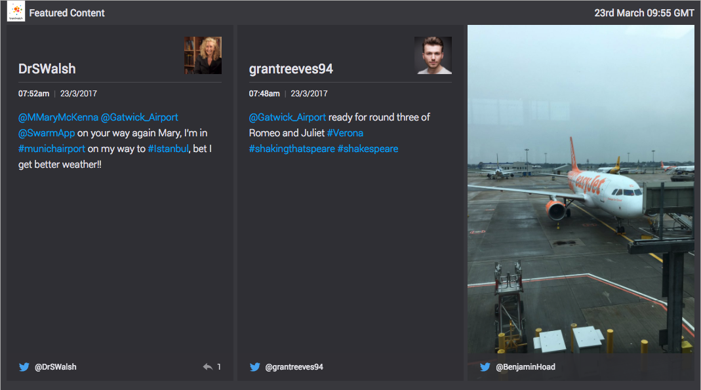

# Featured Content destination

Rotates a streaming collection of mentions. The destination accepts objects with a format described in the [schema](https://github.com/vizia/destination-featured-content/schema.json).



## Demo

```sh
npm start
```

## Architecture

* [Marko](http://markojs.com/) is used for DOM diffing and giving stateful views a lifecycle.
* The destination manages its own state, to allow for an infinitely rotating collection of mentions that fills up as the source pipes through new items. It uses the flux pattern to read/write state _only_ within the [stores](https://github.com/vizia/destination-featured-content/src/stores).
* Every transition will perform a bin-packing algorithm to fit the next set of mentions from the store into the layout when it is ready.
